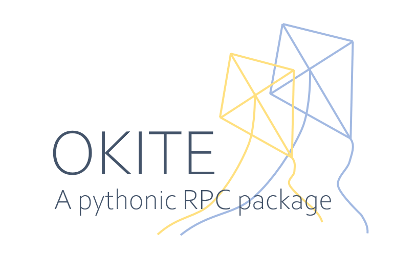

<div align="center">



<p>Okite is a simple, user-friendly RPC package.</p>

<p>
    <a href="https://github.com/Nanguage/okite/actions/workflows/build_and_test.yml">
        
    </a>
    <a href="https://app.codecov.io/gh/Nanguage/okite">
        
    </a>
    <a href="https://pypi.org/project/okite/">
      
    </a>
</p>

</div>

## Installation

```Bash
$ pip install okite
```

## Server side

Using Python API:

```Python
# run_server.py
from okite import Server

server = Server("127.0.0.1:8686")
server.run()
```

Or using the CLI:

```Bash
$ python -m okite server --ip=127.0.0.1 --port=8686
```

## Client side

### Proxy API

Remote function:

```Python
from okite import Client

c = Client("127.0.0.1:8686")

@c.remote_func
def add(x, y):
    return x + y

res = add(10, 32)  # This will execute on remote machine
print(res) # 42
```

Remote object(proxy):

```Python
from okite import Client

c = Client("127.0.0.1:8686")

class Car:
    def __init__(self):
        self.pos = [0, 0]
    
    def move(self, dx, dy):
        self.pos[0] += dy
        self.pos[1] += dx

car = Car()
car_proxy = c.remote_object(car)  # will send 'car' to remote machine(server)
car_proxy.move(10, 20)  # This will change the state of car on server side
car_proxy.move(0, 10)
print(car_proxy.pos)  # [10, 30]
car_proxy.pos = [100, 100]  # This will set car.pos on server side
print(car_proxy.pos)  # [100, 100]
```

### Operations API

| Operation | Asynchronous API | Synchronous API | Description |
| --------- | --------- | -------- | ----------- |
| call | `client.op.call` | `client.sync_op.call` | Call registered function in server |
| register_from_local | `client.op.register_from_local` | `client.sync_op.register_from_local` | Send a function to server side, and register it as a RPC function. |
| unregister_func | `client.op.unregister_func` | `client.sync_op.unregister_func` | Unregister a RPC function in server side. |
| assign_from_local | `client.op.assign_from_local` | `client.sync_op.assign_from_local` | Send a object to server, and assign to a global variable |
| del_var | `client.op.del_var` | `client.sync_op.del_var` | Delete a global veriable in server side environment. |
| eval | `client.op.eval` | `client.sync_op.eval` | Run `eval` function on server |
| exec | `client.op.exec` | `client.sync_op.exec` | Run `exec` function on server |
| set_attr | `client.op.set_attr` | `client.sync_op.set_attr` | Set object's attribute in server side's environment. |
| get_attr | `client.op.get_attr` | `client.sync_op.get_attr` | Get object's attribute from server side's environment. |
| import_module | `client.op.import_module` | `client.sync_op.import_module` | Import a module in server side's environment. |

Example:

```Python
from okite import Client

client = Client("127.0.0.1:8686")

def add(a, b):
    return a + b

client.sync_op.register_from_local(add)
print(client.sync_op.call(add, 1, 2))  # 3
```

## Custom Pickler

You can control the behavior of object serilization/deserilization by
create a custom `Pickler` class. For example, use `json` as the pickler:

```Python
# my_pickler.py
import json
from okite.rpc.stream import PicklerBase

class MyPickler(PicklerBase):
    def serialize(self, obj) -> bytes:
        return json.dumps(obj).encode()

    def deserialize(self, obj_bytes: bytes) -> object:
        return json.loads(obj_bytes.decode())
```

Use `MyPickler` in server:

```Python
# my_server.py
from my_pickler import MyPickler
from okite import Server
from okite.rpc.stream import Streamer

streamer = Streamer(MyPickler())
server = Server("127.0.0.1:8686", streamer=streamer)
server.run()
```

Use `MyPickler` in client:

``` Python
# my_client.py
from my_pickler import MyPickler
from okite import Client
from okite.rpc.stream import Streamer

streamer = Streamer(MyPickler())
client = Client("127.0.0.1:8686", streamer=streamer)
print(client.sync_op.eval("1 + 1"))  # 2
```

## Worker

Using `Worker` you can create a server in a more convenient way:

```Python
from okite.worker import Worker
from okite import Client

with Worker() as w:
    c = Client(w.server_addr)
    res = c.sync_op.eval("1 + 1")
    print(res)  # will print '2'

# or:
w = Worker()
w.start()
c = Client(w.server_addr)
res = c.sync_op.eval("1 + 1")
print(res)  # 2
w.terminated()
```
