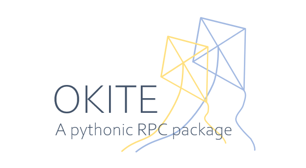

Okite is a simple, user-friendly RPC package.

## Installation

```Bash
$ pip install okite
```

## Usage

### start a server

Using Python API:

```Python
# run_server.py
from okite import Server

server = Server("127.0.0.1:8686")
server.run()
```

Or using the CLI:

```Bash
$ python -m okite server ip=127.0.0.1 port=8686
```

### client side example

Remote function:

```Python
from okite import Client

c = Client("127.0.0.1:8686")

@c.remote_func
def add(x, y):
    return x + y

res = add(10, 32)  # This will execute on remote machine
print(res) # 42
```

Remote object(proxy):

```Python
from okite import Client

c = Client("127.0.0.1:8686")

class Car:
    def __init__(self):
        self.pos = [0, 0]
    
    def move(self, dx, dy):
        self.pos[0] += dy
        self.pos[1] += dx

car = Car()
car_proxy = c.remote_obj(car)  # will send 'car' to remote machine
car_proxy.move(10, 20)  # This will change the state of car on remote side
car_proxy.move(0, 10)
print(car_proxy.pos)  # [10, 30]
```
